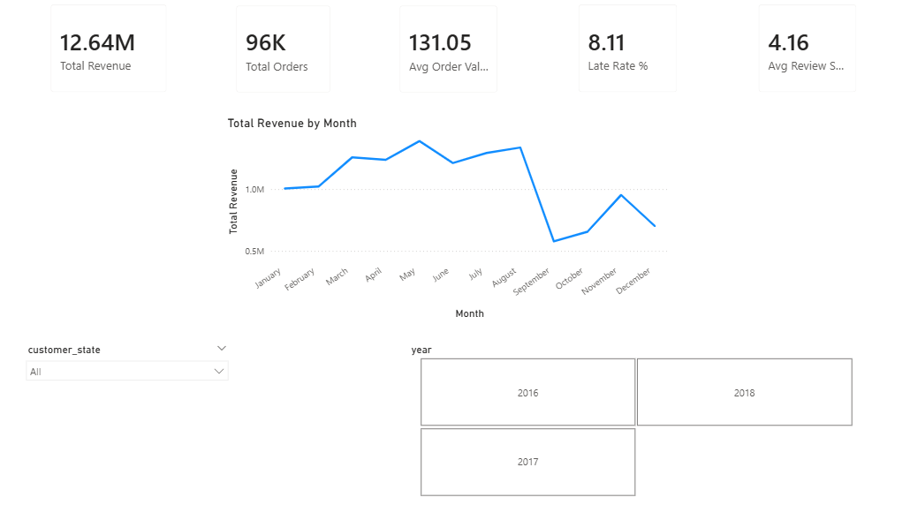
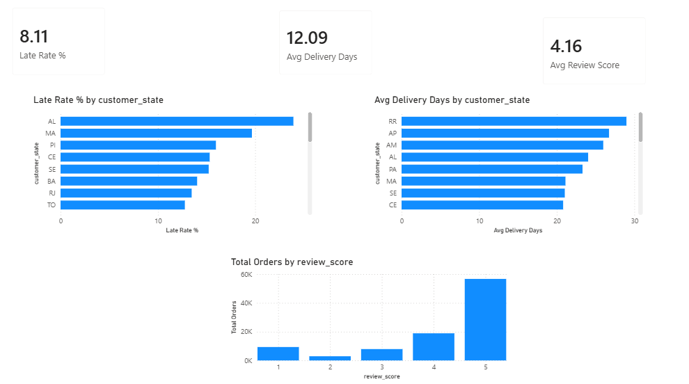

# Retail Supply Chain Intelligence
### End-to-End Analytics Pipeline — 535,000+ Rows

An end-to-end data analytics project analysing Brazilian 
e-commerce transaction data to uncover supply chain 
inefficiencies and customer satisfaction drivers.

---

## Key Findings
- **8.11%** of orders delivered late
- Late orders average **2.8 stars** vs **4.2 stars** for on-time
- Just **3 northern states** cause 31% of all late deliveries
- **Health & Beauty** is the top revenue category
- **78.7%** of customers pay by credit card

---

## Unique Features Built
- Seller Health Score — custom 0–100 composite KPI
- RFM Customer Segmentation — 6 segments
- 6-Week Revenue Forecast with confidence band
- 4-page interactive Power BI dashboard

---

## Tech Stack
| Tool | Purpose |
|---|---|
| Python + Pandas | Data cleaning, EDA, feature engineering |
| MySQL | 10 SQL queries — JOINs, CTEs, window functions |
| Matplotlib + Seaborn | 10 analysis charts |
| Power BI + DAX | 4-page interactive dashboard |

---

## Project Structure

retail-supply-chain-intelligence/
├── scripts/
│ ├── 02_cleaning.py
│ └── 03_eda_charts.py
├── sql/
│ └── analysis_queries.sql
├── outputs/charts/
│ └── (10 Python charts + 4 Power BI screenshots)
└── RetailSupplyChain_Dashboard.pbix

---

## Dashboard Preview

---

## How to Run
1. Download Olist dataset from Kaggle
2. Place CSVs in `data/raw/`
3. `pip install pandas numpy matplotlib seaborn scikit-learn`
4. `python scripts/02_cleaning.py`
5. `python scripts/03_eda_charts.py`
6. Open `RetailSupplyChain_Dashboard.pbix` in Power BI Desktop

---

**Author:** Ashraf Bukhari — B.Tech IT, Ganpat University 2026  
**Contact:** ashrafbukhari68@gmail.com  
**LinkedIn:** linkedin.com/in/ashraf-bukhari-31077a31a
